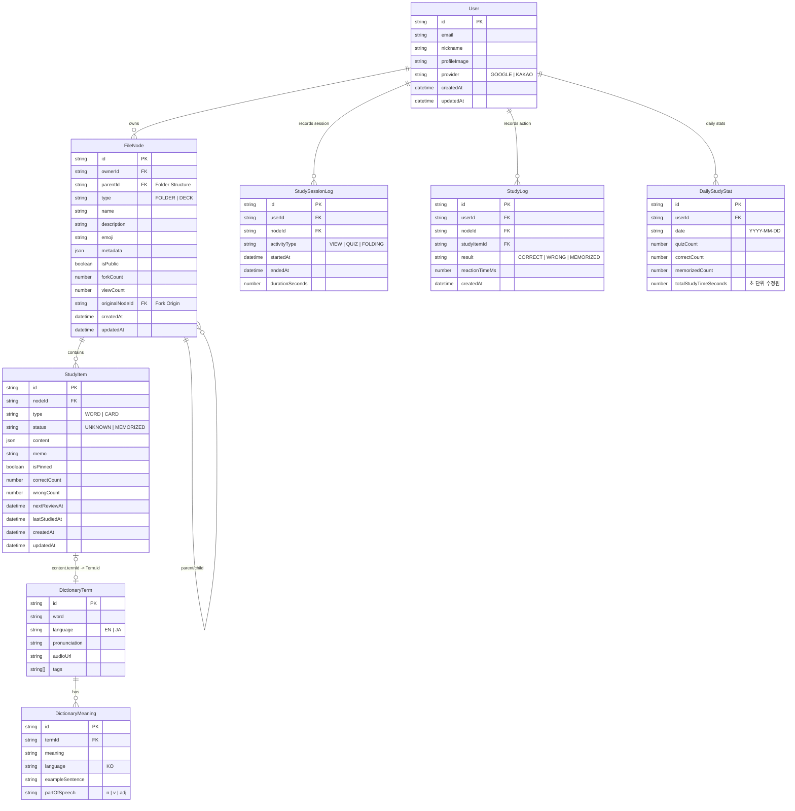

# Entity Relationship Diagram (ERD)

## Overview

This document describes the data model for the Luna application, designed for **PostgreSQL with JSONB** for flexibility and performance.

### Key Design Decisions

1.  **JSON Metadata**: `FolderMetadata` and `DeckMetadata` are stored in a single `metadata` JSONB column within the `FileNode` table to avoid expensive JOINs during tree traversal.
2.  **JSON Content**: `StudyItem` content (Word vs Card) is stored in a `content` JSONB column.
3.  **Seconds Precision**: Study time is tracked in seconds (`totalStudyTimeSeconds`) for accurate micro-learning tracking.
4.  **Session Logging**: `StudySessionLog` tracks user dwell time and activity type in specific nodes.

